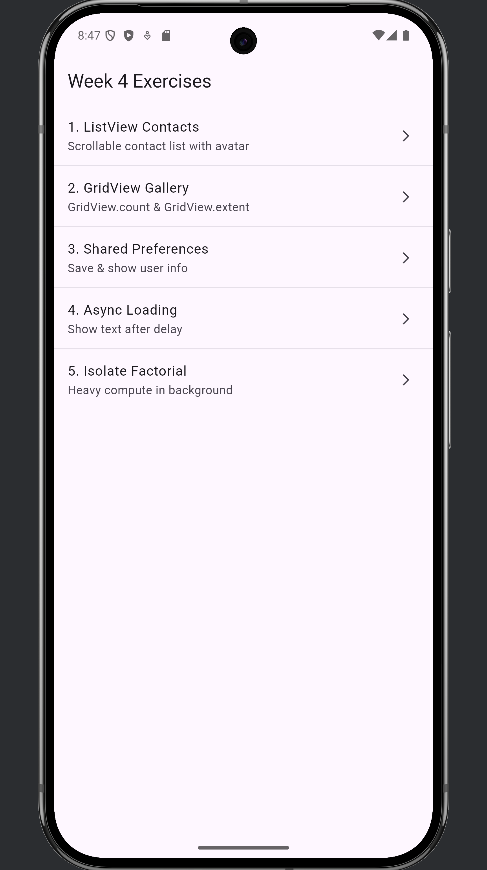
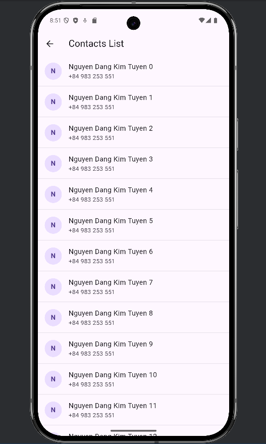
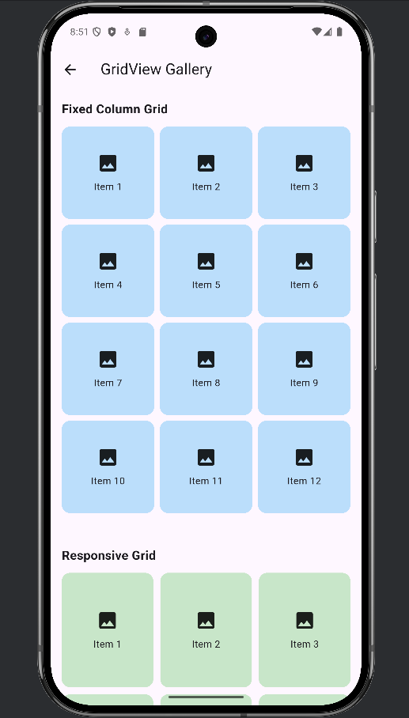
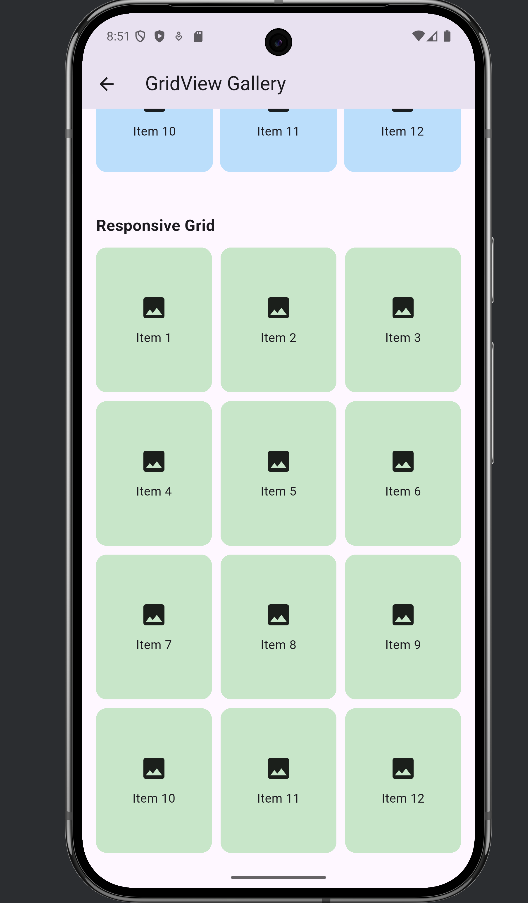
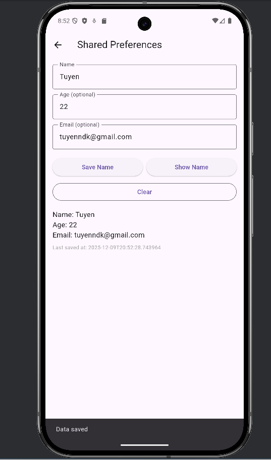
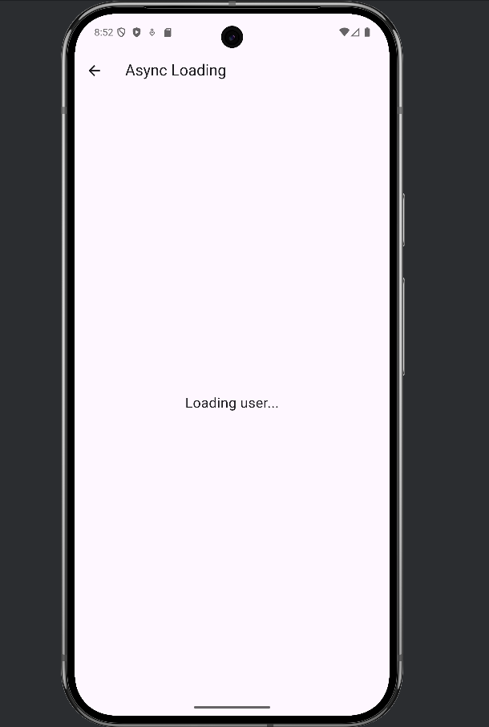
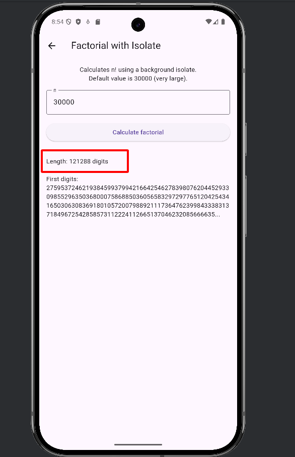
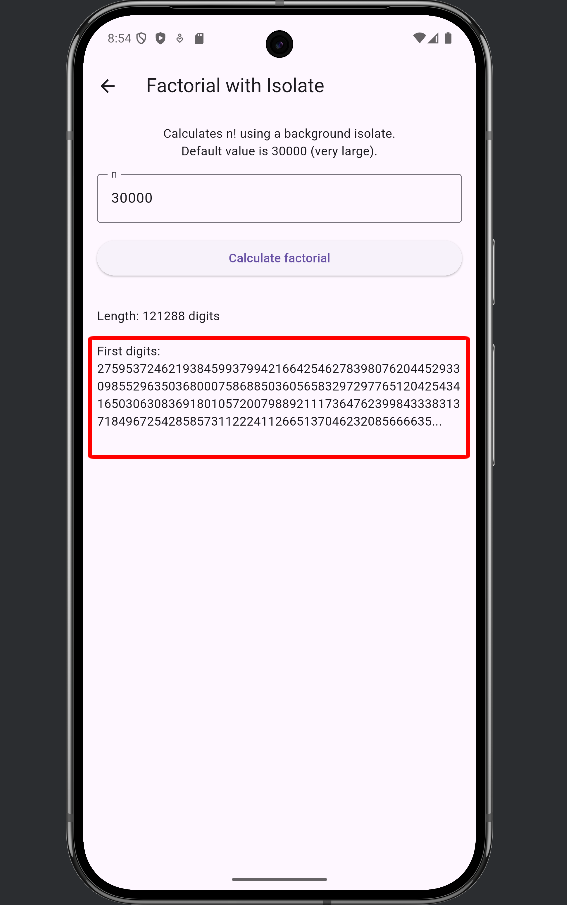
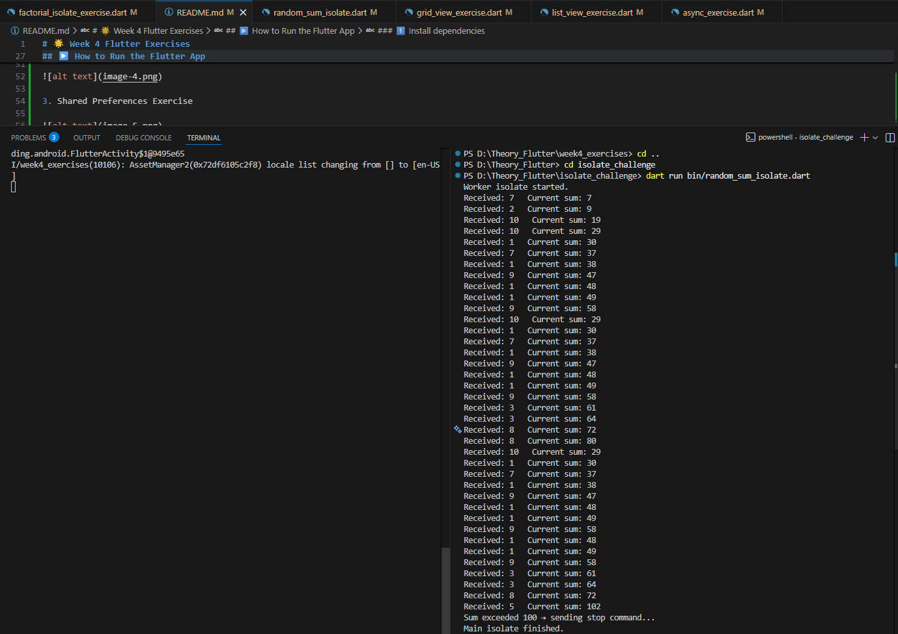

# 🌟 Week 4 Flutter Exercises
video demo: https://drive.google.com/file/d/1tHXtgoJH_hXL4hg7bt84f-k6TQ_jyA1R/view?usp=drive_link

 

 
 
```sh
📂 Project Structure
 📂 Flutter Project
lib/
 ├── main.dart
 ├── list_view_exercise.dart
 ├── grid_view_exercise.dart
 ├── shared_prefs_exercise.dart
 ├── async_exercise.dart
 └── factorial_isolate_exercise.dart
 📂 Dart Console Project
bin/ (Challenge 2 - Dart console isolate)
 └── random_sum_isolate.dart
 ``` 

## 🚀 Overview
This project contains **Week 4 Flutter exercises**, including:

- 📱 ListView  
- 🖼️ GridView  
- 💾 SharedPreferences  
- ⏳ Async / Future  
- 🔥 Isolate (compute)  
- 🎯 Bonus: Dart console isolate (Challenge 2)

Each feature is placed in a separate screen for easy navigation and testing.

---

## 🛠️ Requirements
- Flutter SDK (latest version recommended)  
- Dart SDK (included with Flutter)  
- A physical device, emulator, or Chrome browser  

---

## ▶️ How to Run the Flutter App

### **1️⃣ Install dependencies**
```sh
flutter pub get
2️⃣ Run the app on Android or iOS
flutter run

3️⃣ Run the app on Web
flutter run -d chrome
▶️ How to Run Challenge 2 (Dart Console Isolate)

Navigate to the Dart console project folder and run:

dart run bin/random_sum_isolate.dart

```
1. List View Exercise (Contact)



2. Grid View Exercise


 


3. Shared Preferences Exercise



4. Asynchronous Programming Exercise




5. Isolate Exercises
Challenge 1 
Displays the result once completed



Displays the number of digits



Challenge 2


